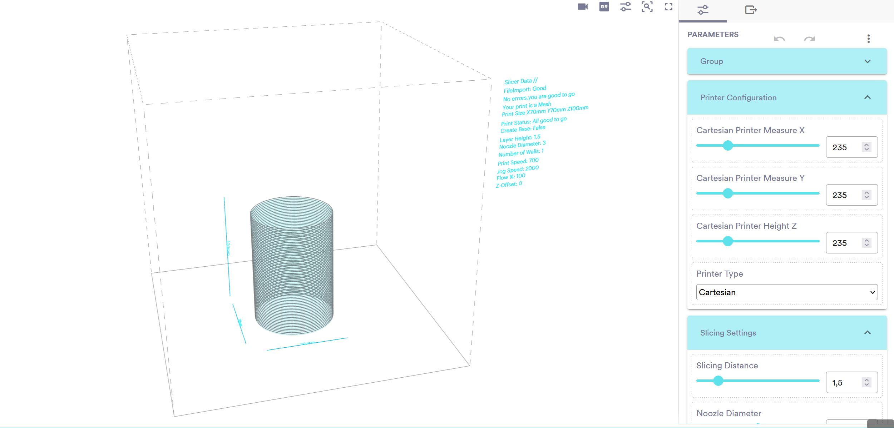
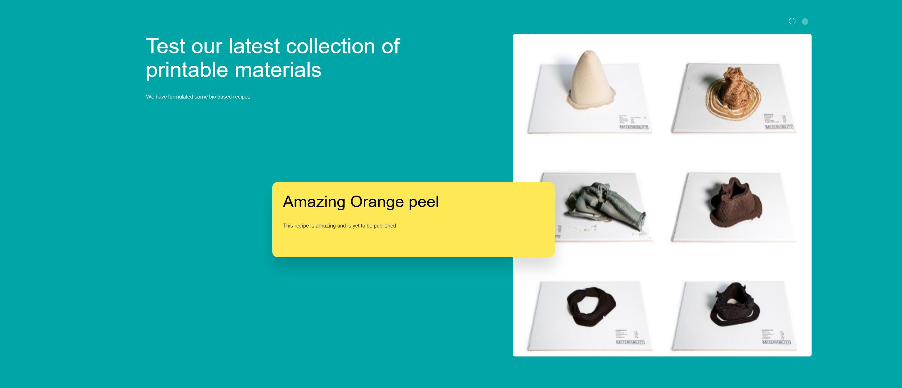
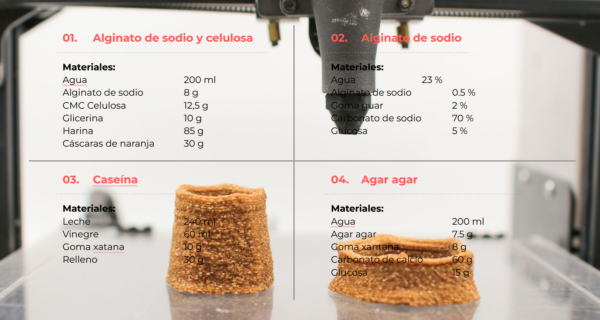

# AEI-CLAB Bio Material Slicer

Repositorio para el proyecto AEI-CLAB. Entregable de FabLab Barcelona conteniendo la página web que permite hacer slicing para impresión 3d de forma simplicada en el navegador [LINK A WEB SLICER](https://fablabbcn.github.io/aei-3d-bio-material-slicer/).

## Resumen de AEI-CLAB

El objetivo de este proyecto es promover el uso de la tecnología maker y la impresión 3D en el ámbito educativo, utilizando materiales sostenibles y biocompatibles como la pasta de biomateriales.
La impresión 3D es una técnica de fabricación aditiva que permite la creación de objetos tridimensionales a partir de un modelo digital. Esta tecnología está revolucionando diversos campos, desde la industria hasta la medicina y la educación.

El uso de la impresión 3D en la educación permite a los estudiantes desarrollar habilidades técnicas y creativas, así como comprender conceptos científicos y tecnológicos de manera práctica y amena. Además, la utilización de biomateriales en la impresión 3D contribuye a la sostenibilidad y al desarrollo de soluciones innovadoras y responsables con el medio ambiente.
Este proyecto incluye talleres y actividades prácticas dirigidos a estudiantes de nivel secundario y universitario, en los que se enseñan los fundamentos de la impresión 3D y se explorarán las posibilidades de la pasta de biomateriales como material de impresión. Los participantes tendrán la oportunidad de diseñar y fabricar sus propios objetos utilizando esta tecnología, fomentando así su creatividad e innovación.
Esperamos que este proyecto contribuya a la formación de una nueva generación de jóvenes comprometidos con la sostenibilidad y la tecnología, y que promueva el uso de la impresión 3D como herramienta educativa y de innovación.

## Instalación de perfiles o software CURA con compatibilidad para la impresora de pasta y biomateriales

El sistema de slicing web se realiza gracias a ShapeDiver. Es una plataforma en la nube para crear aplicaciones en línea basadas en archivos 3D paramétricos creados con Rhinoceros 3D y Grasshopper (visual scripting).

Se aloja la definiciones de Grasshopper en línea, incluidos todos sus parámetros y soluciones, y permite compártirlas con cualquier persona en todo el mundo.
Los servidores de shapediver calculan las soluciones de los conjuntos de parámetros solicitados y envían los resultados en geometría y formatos de datos optimizados para esta aplicación web

Para configurar su archivo, necesita modificar algunos parámetros para ajustarlo a su definición:

- Suba un archivo STL o OBJ (en caso de que no funcione, compruebe que su modelo no es demasiado grande, puede comprobarlo en el mensaje que se visualiza en la interfaz).
- Ajuste primero las medidas para cuadrar las dimensiones de la impresora que esté utilizando (por defecto las medidas de una Creality Ender3)
- Ajuste la altura de capa, diametro de la boquilla, base, spiralización y número de paredes de impresión.
- Ajuste velocidad de impresión, velocidad de jog(movimiento en el aire), flow (cantidad de extrusión de material), y ajuste de offset en el eje Z en caso de que sea necesario y esté imprimiendo sobre una material encima de la cama de impresión.
- Descarge el archivo de código-G (G-CODE) y copielo a la tarjeta SD de la impresora.
- Imprima el archivo cómo un archivo normal.
- En caso de que la impresión no sea correcta, ajuste los valores de flow para compensar sobre o infra extrusión.

## Contenido repositorio
Este repositorio contiene:

- Página web pública con slicer interactivo [link](https://fablabbcn.github.io/aei-3d-bio-material-slicer/)
- Archivo base de grasshopper que permite implementar el script en la plataforma ShapeDiver [link](PastePrinter_machine_extruder_Definitions/fablabbcn_0.def.json)
- Plantilla base sobre la que se basa la página web [html template](template-base)
- Recetas básicas para hacer biomateriales para impresión 3D

## Recetas de biomateriales para impresión 3D

### Receta 01. Alginato de sodio & CMC Celulosa

        Materiales:
        agua 200ml
        Alginato de sodio 8 g
        CMC Celulosa 12,5g
        Glicerina 10 g
        Harina 85 g
        Cáscaras de naranja 30 g

        Instrumentos:
        batidora
        Escala digital

        El secado:
        Tiempo de trabajo no limitado
        Tiempo de secado 7 días
        lugar natural

Proceso:
> Mezcle el alginato de sodio y el agua con la batidora de mano en un vaso de plástico.
> Agregue celulosa CMC y glicerol, mezcle todo lentamente para evitar burbujas de aire.
> Colocar una mezcla pegajosa en un bol y empezar a añadir cuchara a cuchara las pieles de naranja.
> Al final mezclar con harina para espesar el paté.
> Mezcle la mezcla con las manos para probar la consistencia del material.

### Receta 02. Alginato de sodio & Carbonato de sodio

        Materiales:
        Agua 23 % - 115gr
        Alginato de sodio 0,5 % - 2,5gr
        Goma guar 2 % - 10gr
        Carbonato de sodio 70 % - 350gr
        Glucosa 5 % - 25gr

        Instrumentos:
        batidora
        Escala digital

        El secado:
        Tiempo de trabajo no limitado
        Tiempo de secado 7 días
        lugar natural

Proceso:
> Mezcle el alginato de sodio y el agua con la batidora de mano en un vaso de plástico.
> Agregue la goma guar y la miel, mezcle todo lentamente para evitar burbujas de aire.
> Colocar una mezcla pegajosa en un bol y empezar a añadir carbonato de calcio cuchara a cuchara.
> Mezcle la mezcla con las manos para probar la consistencia del material.

### Receta 03. Caseína

        Materiales:
        Leche 240ml
        Vinagre 60ml
        Goma xantana 10 g
        Relleno 30 g

        Herramientas:
        Licuadora
        Escala digital
        Estufa de cocina

        El secado:
        Tiempo de trabajo no limitado
        Tiempo de secado 7 días
        lugar natural

Proceso:
> Precalentar la leche a fuego medio y seguir removiendo todo el tiempo.
> Agregue vinagre muy lentamente, la leche comenzará a cuajar.
> Retire el exceso de agua a través de un colador de malla.
> Mezcle la goma xantana y la caseína con la batidora de mano en un vaso de plástico lentamente para evitar burbujas de aire.
> Colocar una mezcla pegajosa en un bol y empezar a añadir el relleno cuchara a cuchara.
> Mezcle la mezcla con las manos para probar la consistencia del material.

### Receta 04. Agar agar y Carbonato de sodio

        Materiales:
        agua 200ml
        Agar agar 7,5 g
        Goma xantana 8g
        Carbonato de sodio 60 g
        glucosa 15 g

        Instrumentos:
        batidora
        Escala digital

        El secado:
        Tiempo de trabajo no limitado
        Tiempo de secado 7 días
        lugar natural

Proceso:
> Blend xanthan gum and water with the hand blender in a plastic cup.
> Add agar agar and honey blend them all together.
> Place a sticky mixture into a bowl and start adding calcium carbonate spoon by spoon.
> Mix the the mixture with your hands to test the consistency of the material.

## Html template

Está página se basa en el template [AIR](https://freehtml5.co/air-free-html5-bootstrap-template-for-portfolio-and-landing-pages/) provisto por 2016 [Free HTML5](https://freehtml5.co/). All Rights Reserved. Demo Images: [Unsplash](https://unsplash.co/)

Sitio web construido y públicada por Fab Lab Barcelona --> fablabbcn.org/.

## Créditos

Esta página web slicer fue creada por Eduardo Chamorro Martin para FabLab Barcelona en el IAAC (Instituto de Arquitectura Avanzada de Cataluña), en el contexto del programa de ayudas para el apoyo a agrupaciones empresariales innovadoras del Ministerio de Industria, Comercio y Turismo. Convocatoria 2022.

Bajo el proyecto **CLAB: INNOVACIÓN EN PROCESOS DE FABRICACIÓN CIRCULAR Y ABIERTA PARA ENTORNOS EDUCATIVOS**

Partners del proyecto:

- IAAC & FabLab Barcelona
- Fundación Bofill  
- Kid's Cluster
- Abacus cooperativa
- Esteam education
- Anthesis Lavola

## Agradecimientos

-Santi Fuentemilla & Guillem Camprodon por coordinar y apoyar este proyecto.

## Contribuciones

Alentamos a que bifurque el proyecto y haga una solicitud con sus contribuciones al proyecto y desarollo de código y hardware libre.

## Licencia

Estos diseños son de código abierto bajo licencia de hardware CERN Open Hardware Licence v1.2 para más detalles puedes consultar la [licencia hardware completa](LICENSE-hardware) y licencia GNU GPL v3.0 para software,para más detalles puedes consultar la [licencia software completa](LICENSE-software)
